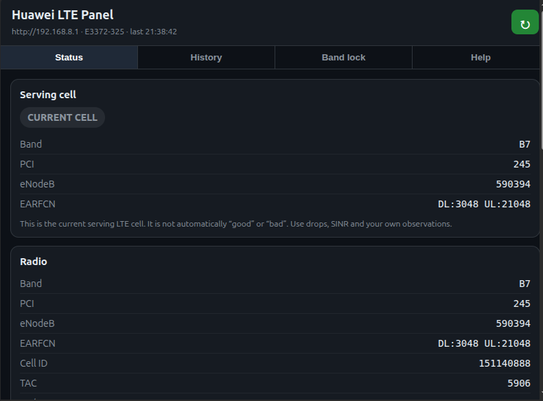
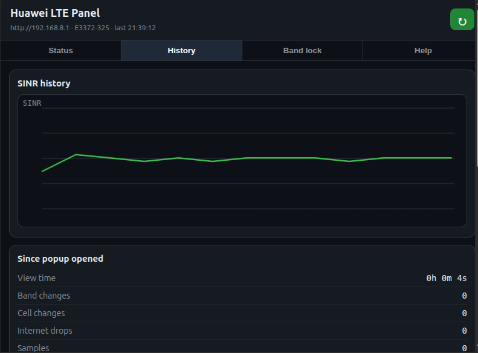
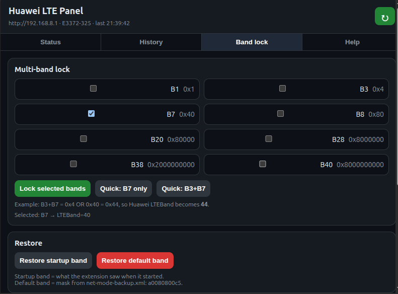

# Huawei E3372-325 LTE Signal Monitor & Band Lock

LTE signal monitoring, cell tracking, Internet drop detection, and LTE band lock management for Huawei E3372-325 HiLink modems.

Compatible with Chromium-based browsers, including Google Chrome, Yandex Browser, Microsoft Edge, Brave, Vivaldi, Opera, Arc Browser, and Chromium.

## Features

* Real-time LTE signal monitoring
* SINR, RSRP, RSRQ and RSSI tracking
* Serving cell monitoring (Band, PCI, eNodeB, EARFCN)
* LTE band lock management
* Support for B1, B3, B7, B8, B20, B28, B38 and B40
* Cell change detection
* Band change detection
* Internet drop detection
* Long-term history storage using IndexedDB
* SINR history chart
* Startup band restore
* Default band restore
* JSON export
* Configurable modem address

## Browser Support

Tested on:

* Google Chrome
* Yandex Browser

Expected to work on:

* Microsoft Edge
* Brave
* Vivaldi
* Opera
* Arc Browser
* Chromium

## Installation

1. Download and extract the release archive.
2. Open `chrome://extensions`.
3. Enable **Developer mode**.
4. Click **Load unpacked**.
5. Select the extension folder.

## Usage

The extension communicates directly with the Huawei HiLink Web API, typically available at:

`http://192.168.8.1`

After installation, open the extension popup to:

* Monitor LTE signal quality
* View serving cell information
* Track Internet drops and cell changes
* Lock LTE bands
* Restore startup or default LTE band configuration
* Export monitoring history

## Notes

Changing LTE bands may temporarily disconnect the modem for 30–90 seconds.

If the modem becomes unreachable after changing bands:

1. Reconnect or power-cycle the modem.
2. Open the extension.
3. Use **Restore Default Band**.

Default LTE band mask:

`a0080800c5`

## Screenshots

### Status

### History

### Band Lock

## Keywords

Huawei E3372-325, Huawei E3372, LTE Monitor, LTE Signal Monitor, LTE Diagnostics, Band Lock, HiLink, SINR, RSRP, RSRQ, LTE Optimization, Cell Monitoring, Antenna Alignment.
