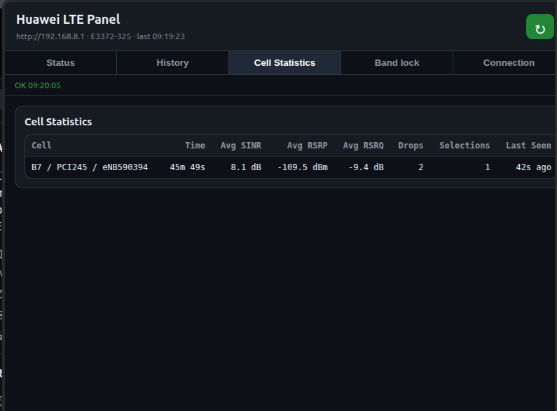
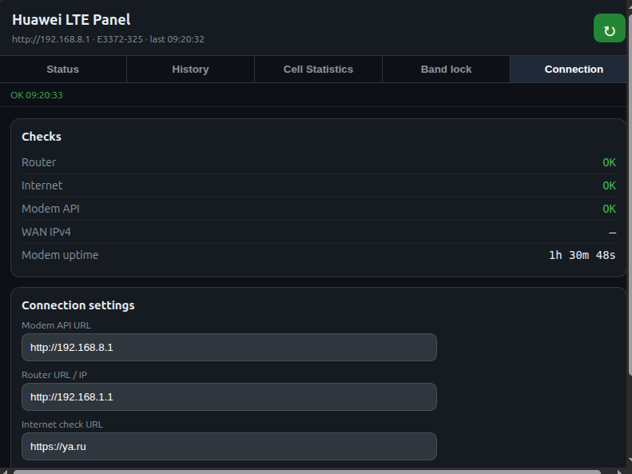

# Huawei E3372-325 LTE Signal Monitor & Band Lock

LTE signal monitoring, cell tracking, Internet drop detection, and LTE band lock management for Huawei E3372-325 HiLink modems.

Compatible with Chromium-based browsers, including Google Chrome, Yandex Browser, Microsoft Edge, Brave, Vivaldi, Opera, Arc Browser, and Chromium.

## Features

* Real-time LTE signal monitoring
* SINR, RSRP, RSRQ and RSSI tracking
* Radio and cell monitoring (Band, PCI, eNodeB, EARFCN)
* LTE band lock management
* Support for B1, B3, B7, B8, B20, B28, B38 and B40
* Band, PCI, eNodeB and EARFCN change detection
* Invalid modem sample detection
* Internet drop detection
* Long-term history storage using IndexedDB
* Per-cell statistics grouped by Band, PCI and eNodeB
* Monitoring ON/OFF control
* Watchdog recovery counter
* Separate SINR, RSRP and RSRQ history charts
* Startup band restore
* Default band restore
* JSON export
* Configurable modem, router and Internet check endpoints

## Browser Support

Tested on:

* Google Chrome
* Yandex Browser

Expected to work on:

* Microsoft Edge
* Brave
* Vivaldi
* Opera
* Arc Browser
* Chromium

## Installation

1. Download and extract the release archive.
2. Open `chrome://extensions`.
3. Enable **Developer mode**.
4. Click **Load unpacked**.
5. Select the extension folder.

## Usage

The extension communicates directly with the Huawei HiLink Web API, typically available at:

`http://192.168.8.1`

After installation, open the extension popup to:

* Monitor LTE signal quality
* View radio and LTE cell information
* Track Internet drops and cell changes
* Lock LTE bands
* Restore startup or default LTE band configuration
* Export monitoring history

## Monitoring and diagnostics

The Status tab shows live modem data only while Monitoring is enabled. If Monitoring is disabled, the Status tab hides live radio data and leaves only the Monitoring control available. History, Cell Statistics and Band lock settings remain available.

Cell Statistics groups LTE cells by Band + PCI + eNodeB. EARFCN is intentionally excluded, so the same cell remains grouped when only EARFCN changes.

The event log distinguishes band, PCI, eNodeB and EARFCN changes. Incomplete modem responses are logged as invalid modem samples and are not counted as cell or band changes.

The extension records user markers for router reboot and modem reconnect so manual actions can be separated from network issues in exported logs.

## Notes

Changing LTE bands may temporarily disconnect the modem for 30–90 seconds.

If the modem becomes unreachable after changing bands:

1. Reconnect or power-cycle the modem.
2. Open the extension.
3. Use **Restore Default Band**.

Default LTE band mask:

`a0080800c5`

## Screenshots

### Status

Monitoring state, signal values and current radio information.

### History

Separate SINR, RSRP and RSRQ charts, event log and export controls.

### Cell Statistics

Long-term per-cell statistics grouped by Band + PCI + eNodeB.

### Band Lock

Current band configuration, multi-band lock controls and restore actions.

### Connection

Router, Internet and Modem API checks plus configurable endpoints.

## Keywords

Huawei E3372-325, Huawei E3372, LTE Monitor, LTE Signal Monitor, LTE Diagnostics, Band Lock, HiLink, SINR, RSRP, RSRQ, LTE Optimization, Cell Monitoring, Antenna Alignment.
